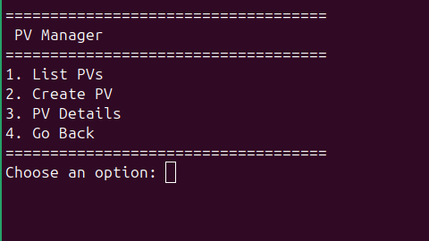

# LVM Manager


LVM Manager is a Bash-based tool designed to simplify the management of Logical Volume Manager (LVM) on Linux systems. It provides an interactive menu for:

- Physical Volumes (PVs)
- Volume Groups (VGs)
- Logical Volumes (LVs)

**This project was developed in just a few hours as part of a training exercise over the weekend.**

## Screenshots





## Requirements

- **Bash**: The script is written in Bash and should be run in a Bash shell.
- **LVM tools**: Ensure that LVM tools (lvm2) are installed on your system.

## Usage

1. **Make the script executable**:
   ```bash
   chmod +x sysinfo.sh
   ```
2. **Run the script**:
   ```bash
   sudo bash ./lvm-manager.sh
   ```
3. **Follow the menu prompts**:
   - The script will display a menu with options to view specific system information or display all details.
   - Enter the corresponding number for the information you want to view.

## Improvements

- **Add "Remove Option" to Each Manager**: Introduce a "Remove" option within every manager for streamlined functionality.
- **Snapshot Manager**: Create Snapshot Manager.

## Contributing

Contributions are welcome! Please open an issue or submit a pull request for any improvements or bug fixes.

## 📝 License

This project is open-source under the MIT License.
